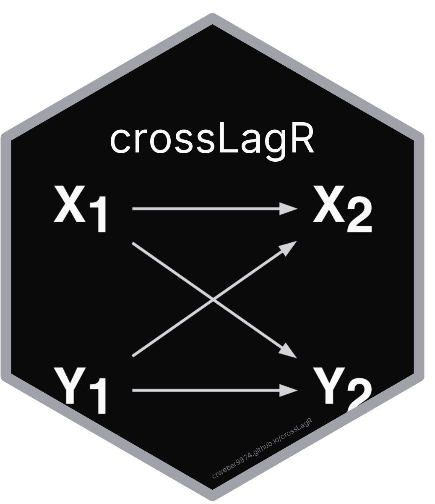

# Preface {.unnumbered}

{width=180 fig-align="center"}

The `crossLagR` package provides tools for estimating, simulating, and evaluating cross-lagged panel models in R. It supports a range of structural equation models for panel data, including the standard Cross-Lagged Panel Model (CLPM), the Random Intercept CLPM (RI-CLPM), the Bollen and Brand dynamic panel model, latent change score models, and latent growth models.

The package is available on GitHub:

```r
devtools::install_github("crweber9874/crossLagR")
```

## Motivation

The Cross-Lagged Panel Model (CLPM) is a widely used method for examining dynamic relationships in panel data. However, it is susceptible to unaccounted time-invariant confounders and measurement error, leading to spurious estimates of autoregressive and cross-lagged relationships. Both the RI-CLPM and the Latent Change Model (LCM) extend the standard CLPM by explicitly modeling unit-level effects --- stable individual differences that are constant across time. In the RI-CLPM, this is represented by a random intercept factor, while in the LCM, it is captured through a constant change factor.

## Organization

This guide is organized as follows:

1. **Theoretical Background.** An overview of the CLPM, RI-CLPM, LCM, LGM, and related models, including their mathematical formulations and the sources of bias in the standard CLPM. The chapter concludes with a unified framework [@usami2019] that organizes all models as special cases sharing common parameter types (`ar_x`, `ar_y`, `cl_xy`, `cl_yx`, etc.).
2. **Using `crossLagR`.** A walkthrough of the package's estimation, simulation, and Monte Carlo functions, with path diagrams and worked examples using simulated data. All estimation functions use the unified labeling convention.
3. **Monte Carlo Simulations.** Compares estimator performance (CLPM, RI-CLPM, Bollen & Brand, Latent Change) under varying degrees of unobserved heterogeneity using 4-wave panel data.
4. **Applied Example.** An empirical application using the Institute for the Study of Citizens and Politics (ISCAP) Panel, examining the relationship between political legitimacy and partisanship from 2012--2020, as well as the Dutch LISS data.
